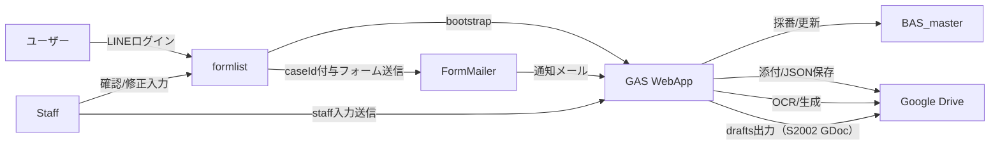

# ARCHITECTURE

破産申立自動化システム（BAS）の全体アーキテクチャとデータフローをまとめます。
案件固有の仕様（フォーム設計、caseId 詳細ルール等）は [PROJECT-BAS.md](PROJECT-BAS.md) を参照してください。

---

## 1. システム構成

### コンポーネント

- **formlist (Next.js, Vercel)**

  - LINE ログイン
  - フォーム一覧・入力リンク生成（署名付き URL を生成）
  - 受付ゲート（Intake Gate）で採番を制御
    - ログイン直後は `api/status` で受付済みか確認し、未済なら「受付フォームのみ」を表示
    - 受付フォームは `lineId|ts` 署名で遷移（caseId なし）
    - 受付完了時に `api/intake/complete` → GAS `action:intake_complete` を呼び出し、初めて採番
      - **受付フォーム（`form_key: intake`）のメール META には `case_id` は載せない。**
      - **代わりに URL の `line_id[0]` を hidden で受け、メール META に `line_id` を載せる。**
      - GAS 側が採番した `case_id` と `user_key` を JSON（`intake__*.json`）へ書き戻し、案件フォルダへ保存する。
    - 以降のフォームは `lineId|caseId|ts` 署名で遷移

- **gas (Google Apps Script, WebApp)**

  - Gmail → Drive の自動整理
  - JSON 保存・命名ルール適用
  - OCR 実行（任意）
  - API ルーティング（HMAC 検証）
    - `doGet(action="bootstrap")`：V2（GET + p/ts/sig, payload=`lineId|caseId|ts`）で受領、contacts/cases/Drive を保証
    - `doGet(action="status")`：V2（GET + p/ts/sig）／V1（互換, HEX）の両対応。副作用あり（staging 吸い上げを起動）
    - `doPost(action="intake_complete")`：V1（HEX）互換で受領。初回のみ caseId を採番し、`<userKey-caseId>` フォルダ作成・cases/status を 'intake' に更新
  - `caseId` 採番・管理（BAS_master スプレッドシート）
  - S2002 ドラフト生成（GDoc テンプレ差し込み）と今後の docx / xls 生成（裁判所提出様式）
  - 5 分間隔の時間トリガで Intake（S2002）処理を常時実行

- **Google Drive**

  - **案件フォルダ = caseKey = userKey-caseId**（例: uc13df-0001）で一意管理
  - JSON / 添付 / staff 入力 / drafts を案件単位で格納

- **Google Spreadsheet (BAS_master)**
  - 擬似データベース
  - `contacts`, `cases`, `submissions` シートでユーザー・案件・送信履歴を管理
    - contacts: `lineId, displayName, userKey, rootFolderId, nextCaseSeq, activeCaseId`
    - cases: `lineId, caseId, createdAt, status, lastActivity`

---

## 2. データフロー概要

---

## 3. 主キー: caseId

- **全データを統合する主キー = caseId**
- caseId は「ユーザー単位の連番 4 桁」（例: `0001`）
- userKey（LINE ID 先頭 6 桁）と組み合わせて案件を一意に識別
  - 例: `uc13df-0001`
- Drive, Sheets, JSON, 生成物すべてが caseId で束ねられる
- **caseKey = userKey-caseId（= Drive フォルダ名）**
- Drive には氏名を含めない。氏名は Sheets(cases)で対応付け

詳細仕様は [PROJECT-BAS.md](PROJECT-BAS.md#3-caseid-仕様) を参照。

## 3.x Google Drive 構成（caseKey ベース）

BAS\_提出書類/
└─ <caseKey>/ # 例: uc13df-0001
├─ attachments/
├─ staff_inputs/
├─ drafts/
├─ s2002_userform**<submissionId>.json
└─ s2011_budget**<submissionId>.json

---

## 4. 依存関係

- **formlist**

  - Next.js (App Router)
  - NextAuth (LINE ログイン)
  - Codex (開発支援)
  - Vercel (デプロイ)

- **gas**

  - Google Apps Script (Drive, Gmail, Spreadsheet API)
  - WebApp デプロイで formlist と連携
  - Script Properties に BOOTSTRAP_SECRET を保持（署名検証用）

- **データ**
  - Google Drive (BAS\_提出書類)
  - Google Spreadsheet (BAS_master)

---

## 5. セキュリティ設計

- **署名検証 (HMAC)**
  - V2（推奨・GET）: payload = `lineId|caseId|ts` を base64url 署名（`p/ts/sig`）
    - `/api/bootstrap`（GAS: action=bootstrap）、`/api/status`（GAS: action=status）
  - V1（互換・POST/一部GET）: `sig = HEX(HMAC_SHA256(`${ts}.${lineId}.${caseId}`))`
    - `action=intake_complete` など既存互換用途で併用
- フォーム URL（外部 FormMailer への遷移）: `makeFormUrl` が V2 署名を生成し、`redirect_url[0]` に `p/ts/sig/lineId/caseId` を付与

### 5.x メール取り込みガード（共通）

- 件名 `[#FM-BAS]` と META ブロック `secret: FM-BAS` の両方を要求（`REQUIRE_SECRET=true`）
- 比較は正規化して厳密化（全角→半角、ダッシュ類統一、ゼロ幅スペース除去、空白除去・小文字化）
- Script Properties: `NOTIFY_SECRET`（未設定時は `FM-BAS` を採用）
  - 改ざん・なりすまし防止（サーバーのみで署名生成）
- **公開範囲**
  - GAS WebApp: 全員アクセス可
  - 認証は署名と caseId で制御
- **データ管理**
  - Drive フォルダごとにユーザー分離
  - BAS_master に案件メタ情報を一元管理

---

## 6. 今後の拡張

- **フォーム統一**: 家計収支表 (S2011) もフォーム入力化 → Excel 自動生成へ
- **OCR 縮小**: 手書き OCR は補助用途に限定
- **UI 拡張**: スタッフ用画面から案件単位で一括確認・出力
- **ワークフロー**: 案件ステータス管理（draft → ready → filed）

---
